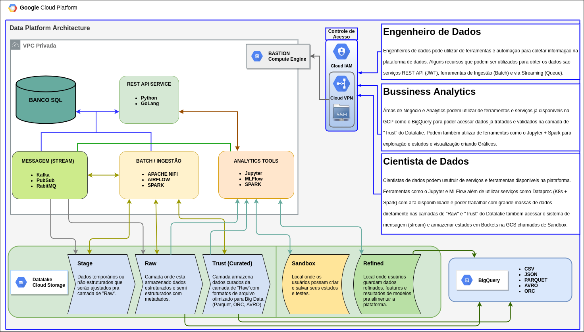

# Infraestrutura Plataforma de Dados GCP

A arquitetura GCP no diagrama abaixo apresenta uma infraestrutura para aproveitar os melhores recursos e soluções disponíveis para trabalhar com um grande fluxo de dados.



O diagrama acima mostra o fluxo de dados possíveis, com o devido permissões no controle de acessos, apresentado através das flechas (arrows) os caminho que os dados podem percorrer e como podem ser acessados utilizando dos serviços como um serviço REST API, streaming, batch e Analytics Tools e aonde cada ferramenta acessaria sobre as camadas do Datalake.

Utilizando recursos de segurança de acessos fornecido pela Google (IAM, VPN, IAP) serviços que utilizem poder computacional (VMs, Kubernetes) serão criados dentro de VPCs privadas, seguindo algumas regras de firewall e segmentação da rede, impedindo acesso via IPs externos. 

Para o acesso desses serviços é necessário uma VPN ou IAP configurado para cada usuário e possivelmente a criação de um Bastion (Controle de acessos via SSH) onde o usuário deve fornecer uma chave publica SSH para infra para poder alcançar serviços internos. Controle de acessos diretos ao Datalake (GCS) e ao BigQuery podem ser garantidos utilizando o próprio Cloud IAM.

### Engenheiro de Dados

Engenheiros de dados pode utilizar de ferramentas e automação para coletar informação na plataforma de dados. Alguns recursos que podem ser utilizados para obter os dados são serviços REST API (Python, Golang), ferramentas de Ingestão (NIFI, Spark, Apache Airflow) e via Streaming (Kafka, RabbitMQ).

### Bussiness Analytics

Áreas de Negócio e Analytics podem utilizar de ferramentas e serviços já disponíveis na GCP como o BigQuery para poder acessar dados já tratados e validados na camada de "Trust" do Datalake. Podem também utilizar de ferramentas como o Jupyter + Spark para exploração e estudos e visualização criando Gráficos.

### Cientista de Dados

Cientistas de dados podem usufruir de serviços e ferramentas disponiveis na plataforma. Ferramentas como o Jupyter e MLFlow além de utilizar serviços como Dataproc (K8s + Spark) com alta disponibilidade e poder trabalhar com grande massas de dados diretamente nas camadas de "Raw" e "Trust" do Datalake também acessar o sistema de mensagem (stream) e armazenar estudos em Buckets na GCS chamados de Sandbox.


## Datalake

Abaixo na tabela a descrição explicando de cada camada do Datalake:

| Camada  | Descrição                                                                                                             |
| ------- | --------------------------------------------------------------------------------------------------------------------- |
| Stage   | Dados temporários ou não estruturados que serão ajustados pra camada de "Raw".                                        |
| Raw     | Camada onde esta armazenado dados estruturados e semi estruturados com metadados.                                     |
| Trust   | Camada armazena dados curados da camada de "Raw"com formatos de arquivo otimizado para Big Data. (Parquet, ORC, AVRO) |
| Sandbox | Local onde os usuários possam criar e salvar seus estudos e testes no formato desejado.                               |
| Refined | Local onde usuários guardam dados refinados, features e resultados de modelos pra alimentar a plataforma.             |


## BigQuery

O BigQuery é um serviço que pode ser usado para carregar grandes datasets e executar tarefas que levaria horas em minutos. Ele pode ser utilizado para carregar arquivos direto do Datalake e ele tem suporte a diversos formatos de arquivo desde o CSV até o PARQUET.

Formatos:

- CSV
- JSON
- PARQUET
- AVRO
- ORC

## Pré-requisitos pra criação da Infraestrutura

Para subir o projeto deve ter instalados no seu terminal os seguintes softwares:

- Google Cloud SDK (gcloud, gsutil)
- terraform (Versão: 0.14)
- kubectl 

## Criação Da infraestrutura

Inicialmente crie uma Service Account (SA) no projeto da GCP para ser responsável pela criação da infraestrutura. Depois de criado gere a chave .json e baixe para seu terminal de trabalho. No teste coloquei esse SA como **Editor**, **Administrador da conta de serviço**, **Agente de serviço do Kubernetes Engine** e **Usuário do túnel protegido pelo IAP** na configuração de IAM. Pode subir como **Proprietário** mas nunca em ambiente de produção.

No primeiro momento crie as variaveis de ambiente em seu terminal que vai executar a criação da infraestrututra como esta mostrado abaixo e execute o login usando essa chave do Service Account:

```sh
$ export GOOGLE_CREDENTIALS='<chave-sa.json>'
$ export GOOGLE_CLOUD_PROJECT='<nome-projeto-id>'

$ gcloud auth activate-service-account --key-file=${GOOGLE_CREDENTIALS} --project=${GOOGLE_CLOUD_PROJECT}
```

Dentro do projeto no diretório **terraform** edite o arquivo `terraform.tfvars`:

```sh
$ vi terraform/terraform.tfvars
```

Edite as seguintes variáveis do terraform com o Id do Projeto e o Service Account Email:

```html
# PROJECT ID
project_id="<PROJETO ID>"
# Service Account INFRA
infra_sa = "<SA EMAIL>"
```

Logo abaixo esta apresentada a estrutura que vamos subir usando o Terraform:

```sh
terraform
├── deployments
│   ├── manifests
│   │   └── rabbitmq
│   │       ├── rabbitmq-cluster.yaml
│   │       └── rabbitmq-operator.yaml
│   ├── helm.tf
│   ├── main.tf
│   ├── postgres-configmap.tf
│   ├── postgres-service.tf
│   ├── postgres.tf
│   ├── rabbitmq.tf
│   ├── roles.tf
├── files
│   └── raw_data.jsonl
├── scripts_spark
│   └── pyspark-convert.py
├── bastion.tf
├── bigquery.tf
├── datalake.tf
├── firewall.tf
├── gke.tf
├── iam.tf
├── main.tf
├── network.tf
├── terraform.tfvars
└── variables.tf
```

Dentro do diretório `terraform` vamos executar a primeira ação depois das variáveis estiverem prontas e o login efetuado:
 
```sh
$ cd terraform
$ terraform init

Initializing the backend...

Initializing provider plugins...
- Finding latest version of hashicorp/google...
- Finding latest version of hashicorp/null...
- Finding latest version of hashicorp/google-beta...
- Installing hashicorp/google v3.61.0...
- Installed hashicorp/google v3.61.0 (signed by HashiCorp)
- Installing hashicorp/null v3.1.0...
- Installed hashicorp/null v3.1.0 (signed by HashiCorp)
- Installing hashicorp/google-beta v3.61.0...
- Installed hashicorp/google-beta v3.61.0 (signed by HashiCorp)

Terraform has created a lock file .terraform.lock.hcl to record the provider
selections it made above. Include this file in your version control repository
so that Terraform can guarantee to make the same selections by default when
you run "terraform init" in the future.

Terraform has been successfully initialized!

You may now begin working with Terraform. Try running "terraform plan" to see
any changes that are required for your infrastructure. All Terraform commands
should now work.

If you ever set or change modules or backend configuration for Terraform,
rerun this command to reinitialize your working directory. If you forget, other
commands will detect it and remind you to do so if necessary.
```

> Logo após isso podemos executar o seguinte comando pra verificar o que será criado:

```sh
$ terraform plan
```

Dentro dessa infraestrutura será criado uma rede privada e um NAT seguindo algumas regras e logo após será criado uma VM que será nosso Bastion que será acessado via IAP (Identity-Aware Proxy). Será o unico ponto de acesso a infraestrutura e é por onde vamos alcançar os serviços internos que serão aplicados em um Cluster GKE que também será criado.

> Subindo a Infraestrutura:

```sh
$ terraform apply
```

Depois de alguns minutos será criado infra e a estrutura do datalake como também um dataset no BigQuery. Existe um arquivo em `terraform/files/raw_data.jsonl` de dados randomicos em **JSONL** que será enviado para o Bucket `dl_raw` e depois será carregado em uma tabela no BigQuery seguindo instruções do `job` que estão em `terraform/bigquery.tf`.
Para testar se o arquivo foi carregado com sucesso, existe uma rotina criada do diretório em `scripts/bigquery.sh`:

```sh
$ ../scripts/bigquery.sh 
Waiting on bqjob_r7e55e3dd9bfa158_0000017865daa499_1 ... (0s) Current status: DONE   
+----------------------------------+-----+
|             contents             | id  |
+----------------------------------+-----+
| 12281dd2bef0ab40685532c184e4b7f7 |   1 |
| a7bc6554d259db97ba7970415d76b14f |   2 |
| 803b664142390fb27333a6c5cfb66327 |   3 |
| 93fbe813a742c21e5b09be3b06faa998 |   4 |
| 138843957b889432c217fe87b4afb4a3 |   5 |
| e32e8083ee8049b521731d62f4dc1c55 |   6 |
| 32678340824eaf0792f8f962d92bbaef |   7 |
| bf096cf35f27e1ce531ec717eb04cd58 |   8 |
| cbdcf8cc0ba4d50c70b877733f0a1631 |   9 |
| cc46154839cd7d4ab02631466a147265 |  10 |
+----------------------------------+-----+
```

## Deploy Serviços GKE

Aqui para subir alguns serviços usei como o RabbitMQ e Postgres estou usando GKE como meu principal recurso. O `endpoint` do meu GKE está dentro de um rede privada e meu unico meio de acesso é pelo Bastion.

> Primeiro vou testar meu acesso ao Bastion:

```sh
$ gcloud beta compute ssh --zone "us-east1-b" "bastion" --tunnel-through-iap --project "${GOOGLE_CLOUD_PROJECT}"
```

> Feita a troca de chaves SSH e autenticado, podemos abrir o tunel. Aqui o `endpoint` do GKE esta em `10.5.0.2`:

```sh
$ gcloud beta compute ssh --zone "us-east1-b" "bastion" --tunnel-through-iap --project "${GOOGLE_CLOUD_PROJECT}" -- -vnNT -L 8443:10.5.0.2:443
```

Muito importante lembrar que esse tunel deve ficar aberto pra execução do deploy de serviços, por isso abra um novo terminal pra executar os primos comandos.

> Preparação antes do deploy dos serviços no GKE. 
> Com o terminal aberto com tunel vamos obter as credenciais do GKE e direcionar o Contexto de Autenticação pro 127.0.0.1 porta 8443:

```sh
# Novo terminal carregar as variaveis de ambiente novamente
$ export GOOGLE_CREDENTIALS='<chave-sa.json>'
$ export GOOGLE_CLOUD_PROJECT='<nome-projeto-id>'
# Obtem as credenciais do cluster GKE
$ gcloud container clusters get-credentials gke-cluster --zone us-east1-b --project ${GOOGLE_CLOUD_PROJECT}
# Cria um novo contexto e aponta pro tunnel SSH ao endpoint do GKE
$ kubectl config set-cluster "gke-cluster-local" --insecure-skip-tls-verify=true --server="https://127.0.0.1:8443"
$ kubectl config set-context "gke-cluster-local" --cluster="gke-cluster-local" --user="gke_${GOOGLE_CLOUD_PROJECT}_us-east1-b_gke-cluster"
$ kubectl config use-context "gke-cluster-local"
```

>  Verificando se deu certo a conexão e a mudança de contexto:

```sh
$ kubectl get nodes
NAME                                         STATUS   ROLES    AGE   VERSION
gke-gke-cluster-deploy-nodes-bbcd90c7-08v7   Ready    <none>   25m   v1.18.15-gke.1501
gke-gke-cluster-deploy-nodes-bbcd90c7-0s7x   Ready    <none>   25m   v1.18.15-gke.1501
gke-gke-cluster-deploy-nodes-bbcd90c7-h2s9   Ready    <none>   25m   v1.18.15-gke.1501
```

> Subindo os serviços no GKE, acessando a pasta `terraform/deployments`:

```sh
$ cd terraform/deployments
$ terraform init

Initializing the backend...

Initializing provider plugins...
- Reusing previous version of gavinbunney/kubectl from the dependency lock file
- Reusing previous version of hashicorp/kubernetes from the dependency lock file
- Reusing previous version of hashicorp/helm from the dependency lock file
- Using previously-installed gavinbunney/kubectl v1.10.0
- Using previously-installed hashicorp/kubernetes v2.0.3
- Using previously-installed hashicorp/helm v2.0.3

Terraform has been successfully initialized!
```

Dentro de `terraform/deployments/main.tf` os **providers** helm e kubernetes fazem a leitura da configuração em `"~/.kube/config"` obtida com os comandos anteriores. Lembre-se de verificar se o TUnnel está de Pé.

```sh
$ terraform apply
```

Dentro dessa pasta o deploy trabalha independente, somente subindo serviços como um Postgres, RabbitMQ e um Spark Operator.

```sh
$ kubectl get all

NAME                                  READY   STATUS    RESTARTS   AGE
pod/postgres-684cdf7587-9nt5q         1/1     Running   0          5m54s
pod/rabbitmq-cluster-server-0         1/1     Running   0          2m7s
pod/spark-operator-674c4d575d-6rlsh   1/1     Running   0          2m49s

NAME                             TYPE        CLUSTER-IP    EXTERNAL-IP   PORT(S)              AGE
service/kubernetes               ClusterIP   10.30.0.1     <none>        443/TCP              41m
service/postgres-service         NodePort    10.30.0.203   <none>        5432:32331/TCP       5m58s
service/rabbitmq-cluster         ClusterIP   10.30.2.173   <none>        15672/TCP,5672/TCP   2m9s
service/rabbitmq-cluster-nodes   ClusterIP   None          <none>        4369/TCP,25672/TCP   2m9s

NAME                             READY   UP-TO-DATE   AVAILABLE   AGE
deployment.apps/postgres         1/1     1            1           5m56s
deployment.apps/spark-operator   1/1     1            1           2m50s

NAME                                        DESIRED   CURRENT   READY   AGE
replicaset.apps/postgres-684cdf7587         1         1         1       5m55s
replicaset.apps/spark-operator-674c4d575d   1         1         1       2m50s

NAME                                       READY   AGE
statefulset.apps/rabbitmq-cluster-server   1/1     2m8s
```

## Testando com Spark

Tive tempo de efetuar só um teste onde executo um código do Spark lendo de um Bucket "RAW" e escrevendo no Bucket "TRUST".
O arquivo escrito em Python já esta no diretório `terraform/scripts_spark` e copiado para `gs://dl_spark_scripts/pyspark-convert.py` quando foi criado a infraestrutura.

Pra executar usamos o próprio `kubectl` no GKE, o arquivo que vai ser executado esta em `scripts/kubectl-spark/pyspark-convert.yaml`. Com o tunel aberto podemos executar o seguinte comando que vai alcançar o `spark-operator` já aplicado no GKE. Esse operador é responsável por fazer a execução e monitoramento dos serviços em Spark.

Aqui executo o Saprk apontando pro `cloud.google.com/gke-nodepool: 'preemptible-nodes'` para utilizar VMs preemptivas de custo mais baixo.

```sh
$ kubectl apply -f scripts/kubectl-spark/pyspark-convert.yaml

$ kubectl get sparkapplication
NAME              AGE
pyspark-convert   12s
```

Esse pyspark lê o arquivo em `gs://dl_raw/raw_data.jsonl` e escreve em `gs://dl_trust/curated.parquet` fazendo a transformção de um JSON em um formato mais otimizado e colunar como o PARQUET podendo também ser usado pra gerar ORCs e AVRO.

```sh
$ kubectl describe sparkapplication pyspark-convert
Name:         pyspark-convert
Namespace:    default
Labels:       <none>
Annotations:  <none>
API Version:  sparkoperator.k8s.io/v1beta2
Kind:         SparkApplication
Metadata:
  Creation Timestamp:  2021-03-24T20:48:05Z
  Generation:          1
  Managed Fields:
    API Version:  sparkoperator.k8s.io/v1beta2
    Manager:         spark-operator
    Operation:       Update
    Time:            2021-03-24T20:49:45Z
  Resource Version:  21273
  Self Link:         /apis/sparkoperator.k8s.io/v1beta2/namespaces/default/sparkapplications/pyspark-convert
  UID:               f9666236-5ba0-4974-b9f4-38e7d708d351
Spec:
  Driver:
    Cores:  2
    Labels:
      Version:        3.0.0
    Memory:           1024m
    Service Account:  spark-sa
  Executor:
    Cores:      1
    Instances:  2
    Labels:
      Version:            3.0.0
    Memory:               2048m
  Image:                  gcr.io/abiding-window-307913/docker-spark-slim:3.0.0
  Image Pull Policy:      Always
  Main Application File:  gs://dl_spark_scripts/pyspark-convert.py
  Mode:                   cluster
  Node Selector:
    cloud.google.com/gke-nodepool:  preemptible-nodes
  Python Version:                   3
  Restart Policy:
    On Failure Retries:                    3
    On Failure Retry Interval:             10
    On Submission Failure Retries:         5
    On Submission Failure Retry Interval:  20
    Type:                                  OnFailure
  Spark Version:                           3.0.0
  Type:                                    Python
Status:
  Application State:
    State:  RUNNING
  Driver Info:
    Pod Name:             pyspark-convert-driver
    Web UI Address:       10.30.14.27:4040
    Web UI Port:          4040
    Web UI Service Name:  pyspark-convert-ui-svc
  Execution Attempts:     1
  Executor State:
    spark-convert-c0b6a97866001458-exec-1:  RUNNING
    spark-convert-c0b6a97866001458-exec-2:  PENDING
  Last Submission Attempt Time:             2021-03-24T20:48:08Z
  Spark Application Id:                     spark-33a2164da9c54f2a9b5a79029677ce4e
  Submission Attempts:                      1
  Submission ID:                            724a8ea8-37b4-4574-8a41-20efadbcdec7
  Termination Time:                         <nil>
Events:
  Type    Reason                     Age                From            Message
  ----    ------                     ----               ----            -------
  Normal  SparkApplicationAdded      112s               spark-operator  SparkApplication pyspark-convert was added, enqueuing it for submission
  Normal  SparkApplicationSubmitted  109s               spark-operator  SparkApplication pyspark-convert was submitted successfully
  Normal  SparkDriverRunning         17s                spark-operator  Driver pyspark-convert-driver is running
  Normal  SparkExecutorPending       12s (x2 over 12s)  spark-operator  Executor spark-convert-c0b6a97866001458-exec-1 is pending
  Normal  SparkExecutorPending       12s                spark-operator  Executor spark-convert-c0b6a97866001458-exec-2 is pending
  Normal  SparkExecutorRunning       11s                spark-operator  Executor spark-convert-c0b6a97866001458-exec-1 is running

```

## Destruindo a Infra

Para destruir a infra somente executar o comando abaixo:

```sh
$ terraform destroy
```

## REFERÊNCIAS

- <https://www.linkedin.com/pulse/3-camadas-para-sucesso-do-meu-data-lake-marcelo-leite-/>
- <https://medium.com/data-hackers/o-guia-semi-definitivo-para-data-lakes-461b1878697f>
- <https://blog.rabbitmq.com/posts/2020/11/rabbitmq-kubernetes-operator-reaches-1-0/>
- <https://www.rabbitmq.com/kubernetes/operator/using-operator.html>
- <https://gcplinux.com/gcp-gke-run-kubectl-through-bastion-host/>
- <https://medium.com/@0d6e/creating-an-ssh-bastion-host-in-google-cloud-vpc-86d65509eb42>
- <https://github.com/hashicorp/learn-terraform-provision-gke-cluster>
- <https://gcplinux.com/gcp-gke-run-kubectl-through-bastion-host/>
- <https://github.com/terraform-google-modules/terraform-google-bastion-host>
- <https://medium.com/@0d6e/creating-an-ssh-bastion-host-in-google-cloud-vpc-86d65509eb42>
- <https://medium.com/faun/creating-reusable-infrastructure-with-terraform-on-gcp-e17745ac4ff2>
- <https://cloud.google.com/nat/docs/overview?authuser=1#private_google_access>
- <https://cloud.google.com/community/tutorials/getting-started-on-gcp-with-terraform>
- <https://gmusumeci.medium.com/how-to-configure-the-gcp-backend-for-terraform-7ea24f59760a>
- <https://gmusumeci.medium.com/getting-started-with-terraform-and-google-cloud-platform-gcp-deploying-vms-in-a-private-only-f9ab61fa7d15>
- <https://github.com/guillermo-musumeci/terraform-gcp-single-region-private-lb-unmanaged>
- <https://github.com/GoogleCloudPlatform/spark-on-k8s-operator>


